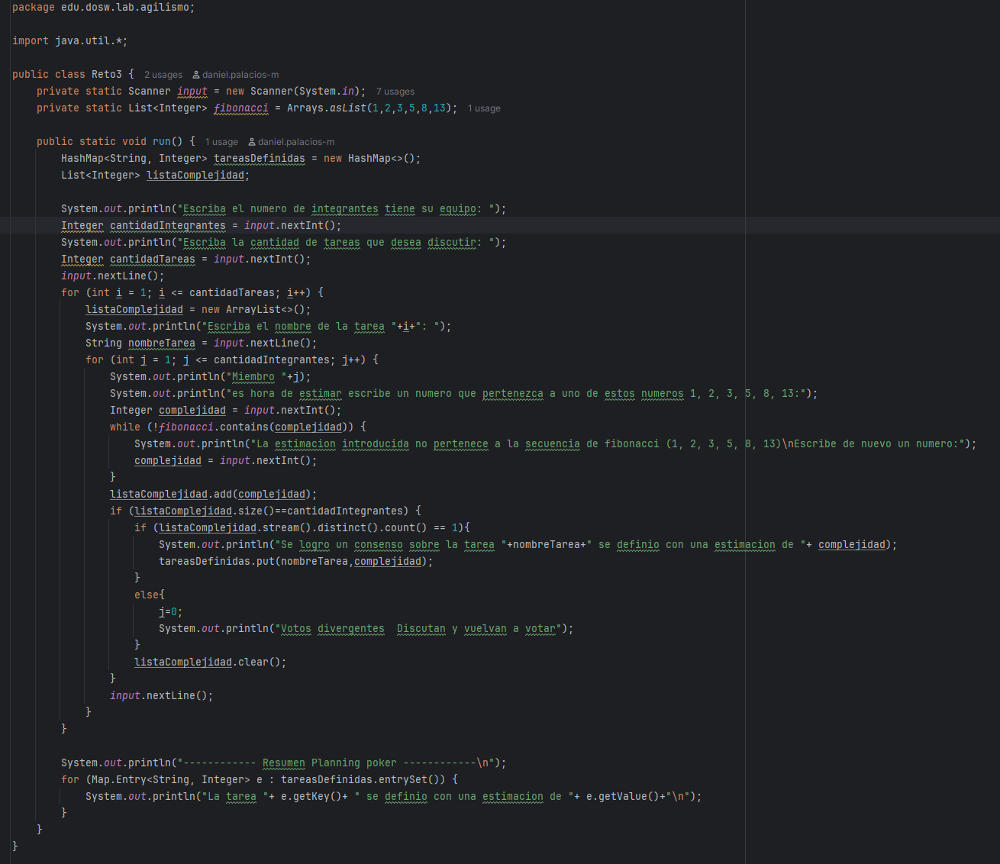
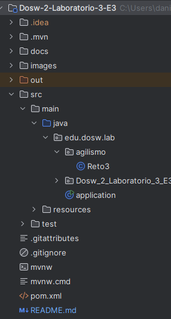
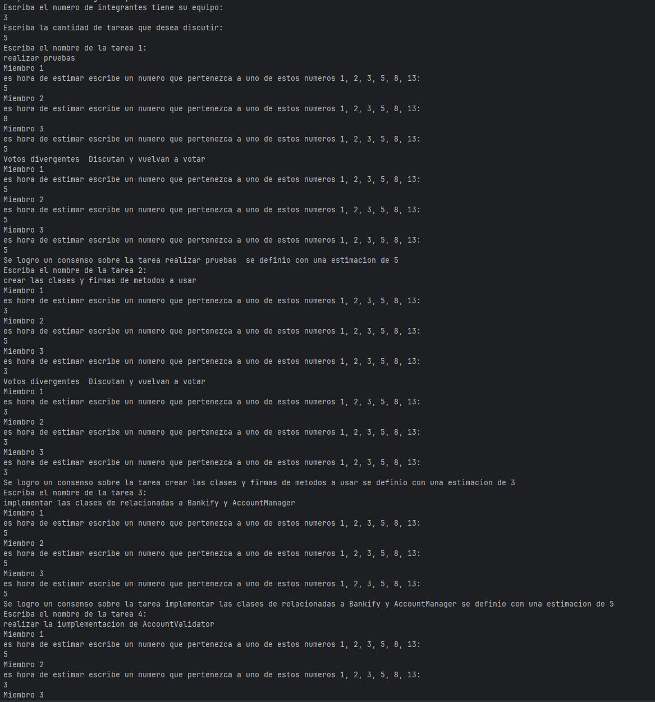
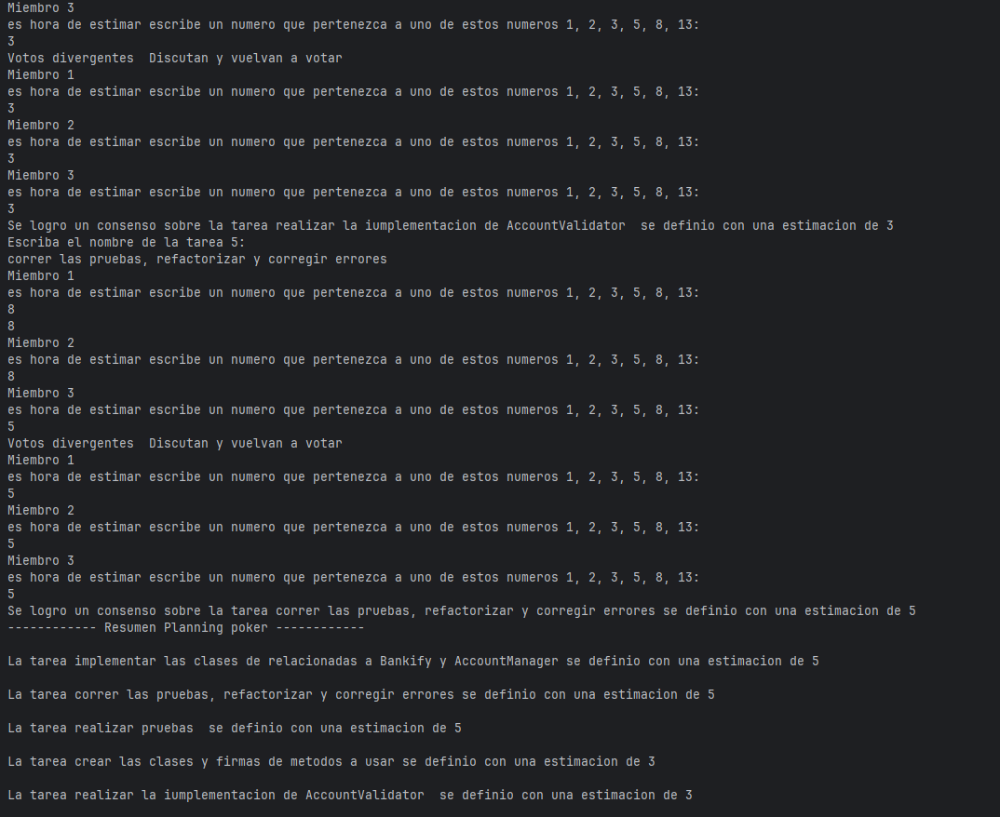

# Dosw-2-Laboratorio-3-E3

# Reto3

**•Evidencia de la implementación en código en el README.md**

- Evidencia del codigo

- Ubicacion del codigo 

**•Patrones**

1. Un patron usado o pensado para ser usado es el de Factory method esto debido a que se planea usar al AccountManager como una especie de factory de cuentas que tambien puede administrarlas.
2. Un patron usado o pensado para ser usado es el de Observer esto para poder manejar notificaciones o actualizaciones en tiempo real por ejemplo el cambio en el balance se le podria notificar al usuario.
3. Un patron usado o pensado para ser usado es el de Singleton esto debido a que para las clases como AccountManager o Bankify se implementen como singletons para asegurar asi una unica instancia esto debido a que se encargan de gestionar globalmente el sistema. 

**•Captura de Pantalla de la Evidencia de las votaciones mostrando todos los casos**

# Primera parte de discusion tareas a realizar:

# Segunda parte de discusion tareas junto a los resultados obtenidos de las tareas a realizar:

