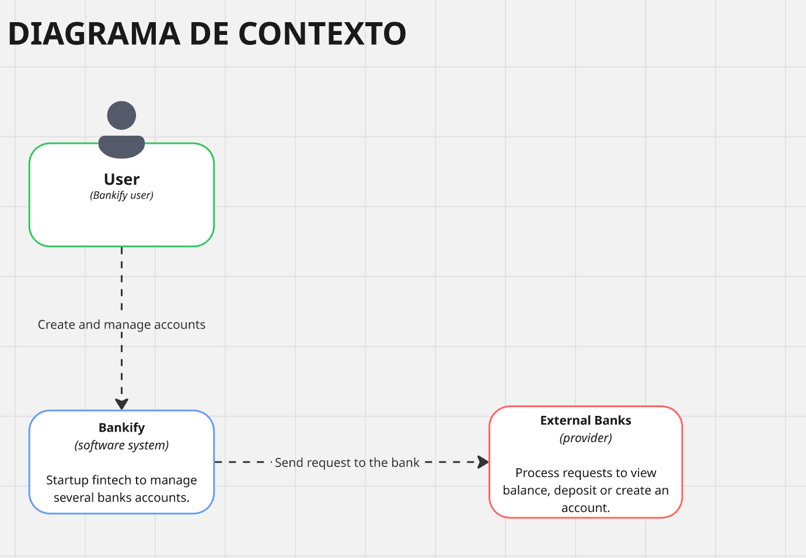
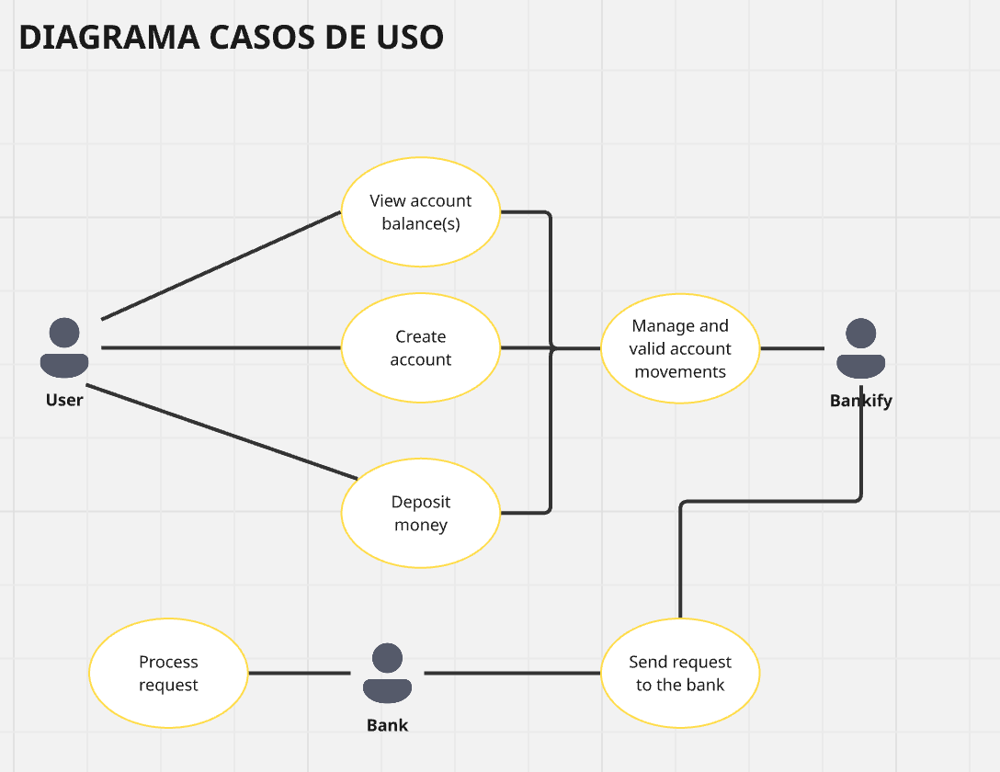
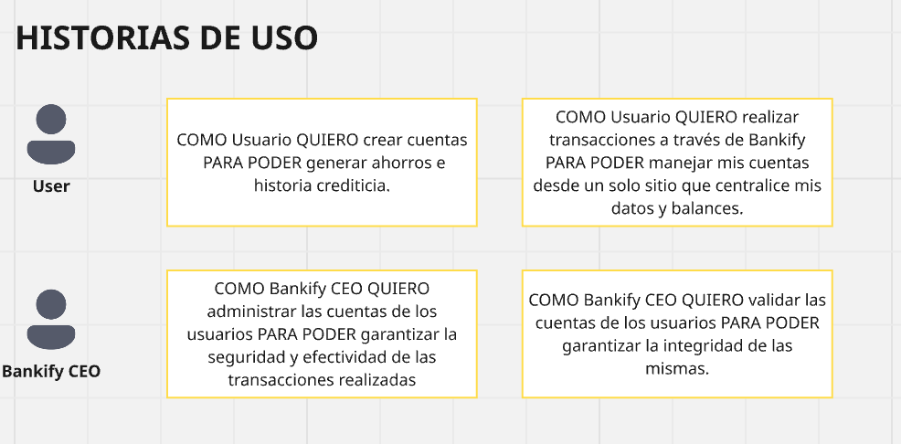
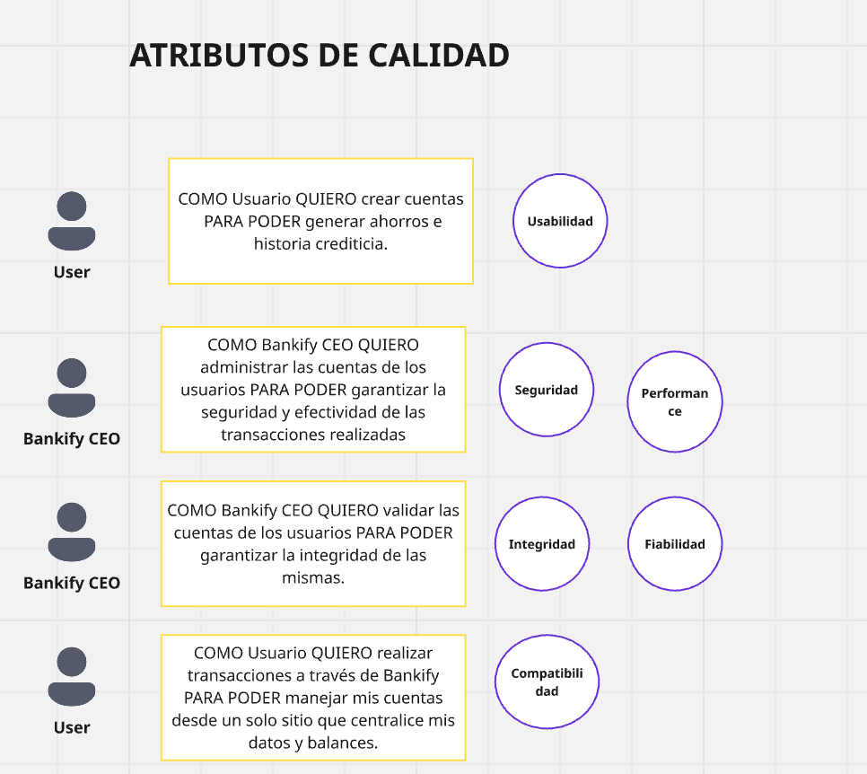
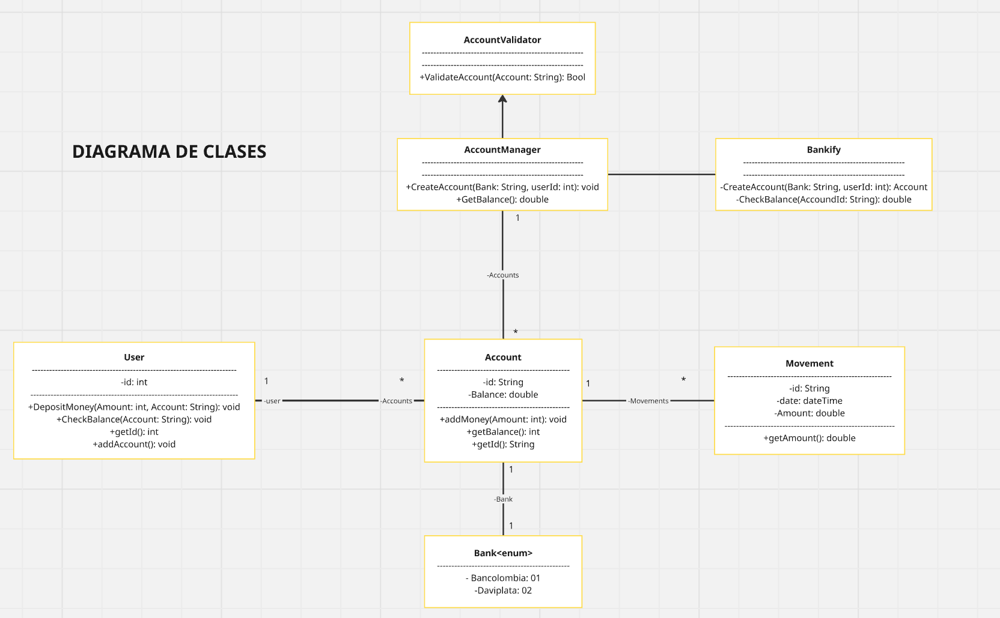
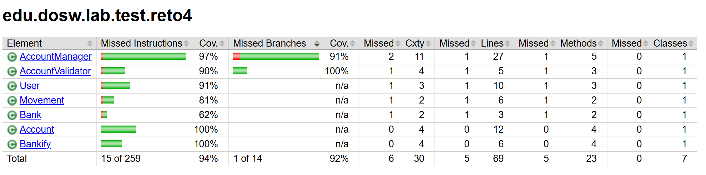
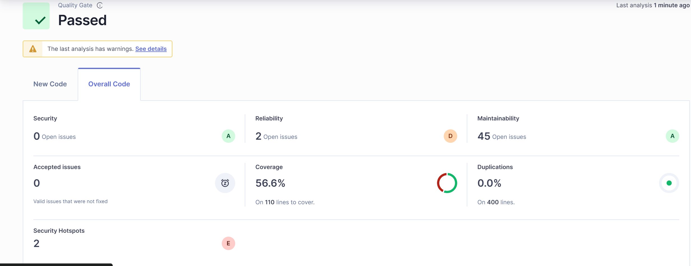

# Dosw-2-Laboratorio-3-E3

### Integrantes
- Daniel Palacios Moreno
- Marlio jose Charry Espitia
- Sofia Nicolle Ariza Goenaga

## Reto 1
**Desarrollo:**

**Reglas de Negocio:**
- El numero de cuenta debe tener 10 digitos
- Los dos primeros digitos del numero de cuenta deben corresponder a un banco registrado
- El numero de cuenta no puede tener letras o caracteres especiales
- El saldo de una cuenta no puede ser negativo

**Funcionalidades:**
- Crear una cuenta bancaria
- Validar cuenta bancaria
- Consultar saldo de una cuenta
- Hacer un deposito

**Actores**
- Usuario
- Bankify
- Bancos externos

**Precondiciones**
- Conocer el par de numeros que identifican cada banco
- Conocer bancos registrados y existentes
- Tener una base de datos disponible

# Reto 2

# Reto3

**•Evidencia de la implementación en código en el README.md**

- Evidencia del codigo

- Ubicacion del codigo 

**•Patrones**

1. Un patron usado o pensado para ser usado es el de Factory method esto debido a que se planea usar al AccountManager como una especie de factory de cuentas que tambien puede administrarlas.
2. Un patron usado o pensado para ser usado es el de Observer esto para poder manejar notificaciones o actualizaciones en tiempo real por ejemplo el cambio en el balance se le podria notificar al usuario.
3. Un patron usado o pensado para ser usado es el de Singleton esto debido a que para las clases como AccountManager o Bankify se implementen como singletons para asegurar asi una unica instancia esto debido a que se encargan de gestionar globalmente el sistema. 

**•Captura de Pantalla de la Evidencia de las votaciones mostrando todos los casos**

# Primera parte de discusion tareas a realizar:

# Segunda parte de discusion tareas junto a los resultados obtenidos de las tareas a realizar:

# Reto 4

Al ejecutar JaCoCo se obtuvo el siguiente resultado de cobertura:

- *Cobertura de instrucciones: 94%*
- *Cobertura de ramas: 92%*

La gran mayoría del código de reto4 se encuentra cubierto por pruebas unitarias. 
Sin embargo, aún existen algunas líneas y al menos una condición no cubierta. 
Las clases con menor cobertura parcial son:
- Account
- Bankify
- AccountValidator

En general, el nivel de cobertura es muy alto, lo que asegura confianza en la calidad del código y en el comportamiento de la lógica implementada.
Por lo tanto, el requisito se cumple sin necesidad de añadir nuevos casos de prueba.

En este laboratorio no fue necesario añadir casos de prueba extra, ya que la cobertura de JaCoCo alcanzó niveles superiores al umbral exigido, como
primero se escribieron las pruebas unitarias que fallaban y luego se fue construyendo el código hasta que todas pasaron, lo que permitió obtener un software funcional 
y confiable desde el inicio. Este enfoque aseguró una cobertura alta (94% de instrucciones y 92% de ramas según JaCoCo) sin necesidad de añadir 
pruebas adicionales, demostrando la utilidad de TDD para garantizar calidad y confianza en la lógica implementada.
Sin embargo, el análisis de cobertura sigue siendo útil porque permite identificar qué partes del código fueron ejercitadas por las pruebas 
y qué ramas o escenarios alternativos no se ejecutaron. La métrica de cobertura es importante porque asegura que el código es validado de forma 
amplia, genera confianza en la calidad del software y ayuda a prevenir errores en ejecución.

# Reto 5
El proyecto fue construido usando Maven, generando los reportes de cobertura de código mediante Jacoco. El reporte se encuentra en:

Se integró el proyecto con SonarQube para análisis estático de código. El comando utilizado fue:
(mvn "sonar:sonar" "-Dsonar.host.url=http://localhost:9000" "-Dsonar.login=squ_59dc456294723ca87b69d44c29ea7cee87411f18")

El análisis arrojó los siguientes resultados:

- Quality Gate: Passed ✅
- Cobertura: 56.6%
- Duplicaciones: 0%
- Security Hotspots: 2
- Reliability: 2 issues
- Maintainability: 45 issues

El sonar realiza la cobertura con base en todo el proyecto, el proceso de TTD fue realizado para
el reto 4, al no haber pruebas generales para los otros retos el porcentaje de cobertura baja.

*Reflexion:*

**Marlio**

Hacer pruebas al software no es solo para cumplir con el proceso, es lo que realmente te permite saber si lo que desarrollaste 
funciona bien y no va a fallar cuando lo use alguien más. Además, te ayuda a detectar desde temprano problemas de rendimiento,
seguridad o mantenimiento que, si se dejan pasar, pueden volverse un dolor de cabeza más adelante.

**Daniel**

Realizar pruebas es una forma de cuidar tu trabajo. Te ayuda a entender cómo se comporta el sistema en distintos escenarios, 
anticiparte a posibles fallos y mejorar la calidad del producto. Al final, un software bien probado habla bien del 
desarrollador que lo construyó.

**Sofia**

Al escribir el código y luego nosotros mismos crear las pruebas, podemos caer en el error de crear los test para validar 
nuestro código y no para realmente verificar las reglas de negocio, lo que resulta en pruebas ineficaces, que no cumplen 
con su propósito. Al pensar primero en las pruebas, establecemos unos parámetros que se tienen que cumplir antes de empezar 
a codificar, así podremos diseñar los programas con el objetivo del programa en mente.
